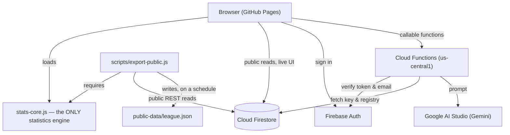

# Elderly Support League — System Status

**State:** live in production, `main` synced to GitHub Pages.
**Database:** Firestore — `matches_v2`, `players_v2`, `locations`, `awards`,
`fixtures`, `roasts`, `config/*` are canonical. `matches` / `players` are
retired (read-only, kept for history).
**Backend:** Cloud Functions, Node 22, `us-central1`.

For the itemized history of what shipped and when, see
[`docs/PLAN.md`](PLAN.md). This file is a snapshot of the current system, not
a changelog.

---

## 1. Architecture



`stats-core.js` is the single implementation of Elo, chemistry, streaks,
nemesis, attendance, and the optimal-lineup finder. It is loaded by
`index.html` before `app.js`, and `require()`'d by `scripts/export-public.js`.
The website's Stats tab and the public JSON export run identical code — they
cannot disagree with each other.

`functions/index.js` keeps its own copy of the Elo engine, because Cloud
Functions only upload the `functions/` directory and cannot `require()` a
file outside it. `tests/elo-parity.test.js` runs both against the same
dataset and fails if a single rating diverges.

## 2. Access model

Two tiers. There is no role system in Firebase — these are hardcoded email
allowlists, kept in step across three places: `firestore.rules`
(`isOwner()` / `isOrganizer()`), `functions/index.js`
(`OWNER_EMAIL` / `ORGANIZER_EMAILS`), and `app.js` (`SUPER_ADMIN` /
`ORGANIZERS`, presentation only).

| | Organizer | Owner |
|---|---|---|
| Match entry, edit | ✅ | ✅ |
| Add players, venues | ✅ | ✅ |
| Fixtures, roasts (create, publish) | ✅ | ✅ |
| Every AI tool | ✅ | ✅ |
| Delete a match / roast / fixture | — | ✅ |
| Rename or delete a player | — | ✅ |
| Gemini API key, model, connection test | — | ✅ |
| Roast opt-out list, profanity setting | — | ✅ |

The split is about blast radius, not trust: an organizer can do the whole
week-to-week job; only the owner can touch billing, reopen a promise made to
an opted-out player, or destroy history that has no undo.

## 3. Feature areas

- **Matches** — Standard (2 teams, goals) and Tournament (3 teams, ranked)
  formats. Mobile-first entry: roster quick-pick grid, AI Magic Paste from a
  raw WhatsApp message, tournament rank buttons, duplicate-match guard.
- **Player identity** — canonical `players_v2` registry with a resolver that
  hard-gates save on any ambiguous or unresolved name.
- **Statistics** — Elo ratings (provisional under 5 games), streaks and
  rolling form, nemesis/rivalry, chemistry matrix (min-games threshold,
  Win%/PPG/games-together toggle, sortable, tap-a-player focus mode on
  narrow screens, tap-a-cell match detail), optimal 5-player lineup, curse
  stat, attendance and milestones, venue goal averages.
- **Community tab** — next fixture (with an "awaiting result" state once a
  scheduled match's time has passed), roast of the week (demotes to "latest
  roast" after 7 days, retires after 30), weekly power rankings, milestone
  watch, monthly awards. Awards use a tiered qualifier — `qualified` →
  `relaxed` → `best available` — so a thin month shows a labelled
  approximation instead of rendering blank.
- **Deep links** — `?player=`, `?match=`, `?roast=`, `?fixture=`, `?tab=`.
- **PWA** — installable, offline reads via a service worker
  (`docs/SERVICE_WORKER.md`), Web Share on match/player/roast/fixture cards.
- **Public data export** — `public-data/league.json`, generated by
  `scripts/export-public.js` from `stats-core.js` (schema v2: counting
  stats, Elo, chemistry pairs, streaks, nemesis, attendance — no roasts, no
  Elo/chemistry reimplementation risk). Refreshed automatically every 6h by
  `.github/workflows/refresh-public-data.yml`, or on demand from the Actions
  tab. See `docs/PUBLIC-DATA.md`.

## 4. Cloud Functions

| Function | Tier | Purpose |
|---|---|---|
| `setGeminiKey` | Owner | Set/validate the Gemini API key |
| `testGeminiConnection` | Owner | Connection test, lists live models |
| `setGeminiModel` | Owner | Persist the selected model |
| `parseLineup` | Organizer | AI Magic Paste — raw text → structured match |
| `generateMatchRecap` | Organizer | Two-sentence factual match recap |
| `queryStats` | Organizer | Natural-language stats Q&A |
| `generateAwardsCopy` | Organizer | Award/milestone citation copy |
| `suggestAliases` | Organizer | Alias suggestions on player creation |
| `auditDataHealth` | Organizer | Data anomaly diagnostic |
| `getRoastAngleCandidates` | Organizer | Roast Studio: candidate angles |
| `generateRoastVariants` | Organizer | Roast Studio: generate variants |
| `publishRoast` | Organizer | Publish a roast to the Community tab |
| `generateFixturePreview` | Organizer | Draft a fixture with predicted winner |
| `saveFixture` | Organizer | Persist a fixture |
| `resolveFixtureToMatch` | Organizer | Link a played fixture to its match |
| `archiveFixture` | Organizer | Archive a fixture |
| `saveRoastSettings` | Owner | Intensity, profanity, opt-out list |
| `triggerBackup` | Owner | On-demand Firestore backup |
| `scheduledBackup` | — (Sunday 03:00 cron) | Automated weekly backup |

Deletion of a roast, and deletion of a match, are direct Firestore writes
gated by `firestore.rules` (owner-only) — no Cloud Function involved.

## 5. Testing

```bash
# Elo parity: stats-core.js vs. the functions/index.js copy
node tests/elo-parity.test.js

# Firestore rules — needs the emulator running first (see tests/README.md)
firebase emulators:start --only firestore --project demo-esl
FIRESTORE_EMULATOR_HOST=127.0.0.1:8085 node tests/firestore-rules.test.js
```

Both currently pass (65 rules assertions, full Elo agreement across every
player).

`scripts/test_*.js` predate the `stats-core.js` extraction — several assert
against `app.js`'s source text directly and now fail, since the engines they
check for moved to `stats-core.js`. They have not been updated; treat them as
historical rather than a live suite. `tests/` is the current one.
