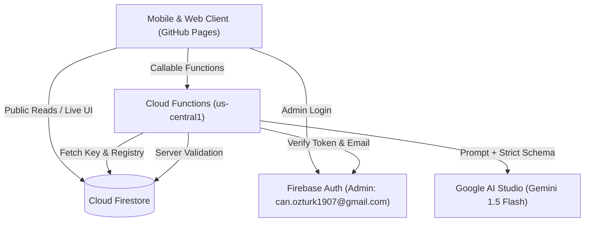

# Elderly Support League — System Status & Capabilities Report

**Current State:** Stages A, B, and C Complete · Live in Production  
**Active Branch:** `main` (Latest commit synced with GitHub Pages)  
**Database:** Cloud Firestore (`matches_v2`, `players_v2`, `locations`, `config/gemini_meta`)  
**Backend:** Firebase Cloud Functions (Node.js 22, `us-central1`)  

---

## 1. System Overview & Architecture



### Security & Access Control
- **Zero Client Key Exposure:** The Google AI Studio Gemini API key is stored securely in Firestore `config/gemini` with `allow read, write: if false;`. It is never transmitted to or readable by any web client.
- **Admin Authentication:** All administrative actions (saving matches, editing, deleting, updating AI settings, creating players/locations) are enforced by `firestore.rules` and Cloud Functions via Firebase Auth email verification (`can.ozturk1907@gmail.com`).
- **Data Integrity:** Production data runs exclusively on canonical collections `players_v2` (68 unique identities) and `matches_v2` (65 verified matches).

---

## 2. Completed Features & Functionality

### 🟢 Stage A — Core Engine & Quality Fixes
- **Full HTML Escaping & Injection Defense:** All user and player inputs are escaped via `esc()` and URL schemes are validated via `safeUrl()`.
- **Apostrophe & Special Character Handling:** Player management uses delegated DOM listeners and `data-` attributes, fully supporting names with apostrophes (e.g. `O'Brien`, `D'Angelo`) and accents.
- **Timestamp & Date Robustness:** Fixed `NaN` sorting bugs by using Firestore `Timestamp.toMillis()`. Defensive date parsing guards against corrupted documents.
- **Unified Filtering ("All Time" / Year / Month):** Leaderboard, stats summary, and individual player modals respect active filters synchronously.
- **PPG Minimum-Appearance Qualifier:** Leaderboard enforces a **10-appearance qualifier** to rank on Points-Per-Game. Unqualified players are displayed below a clean separator.
- **Venue & Match Statistics:** High-scoring games, biggest blowouts, most frequent draws, and per-venue goal/win averages (indoor vs. outdoor).

---

### 🟢 Stage B — Canonical Identity Layer & Resolver
- **Authoritative Player Registry (`players_v2`):**
  - Stable player IDs (e.g., `daniel_gomez`, `daniel_muller`, `anderson_brazil`, `javi_farres`, `javi_bernardo`).
  - Case-insensitive alias matching array (`aliases: ["dani g", "dani gomez", "daniel g"]`).
  - Matches store immutable player IDs instead of raw strings; display name updates propagate across all historical stats instantly.
- **Zero-Typo Resolver with Hard Gate:**
  - **Green Chip (Resolved):** Exact alias or high-confidence match.
  - **Amber Chip (Ambiguous):** Single high-confidence fuzzy candidate requiring 1-tap confirmation.
  - **Red Chip (Conflict / Multiple Candidates):** Forces explicit maintainer selection.
  - **New Player Dialog:** Prompts before creating a new canonical player, displaying the 3 closest existing names first to eliminate typos.
  - **Hard Gate:** The **SAVE** button is strictly disabled whenever any chip is Amber or Red.
- **Context Constraints:** Automatically prevents the same player from appearing on multiple teams in the same match.

---

### 🟢 Stage C — Mobile-First Entry & AI Magic Paste
- **AI Magic Paste (Lineup Extraction):**
  - Paste unmodified WhatsApp lineup messages directly.
  - Cloud Function `parseLineup` injects the active roster registry into Gemini, extracting match type, date, venue, team names, jersey colors, scores, and player IDs.
  - **Resilient Parsing:** Strips role markers (e.g. `Patrick (Ref)`), parses nickname initials (`Dani G` → `Daniel Gomez`, `Dani M` → `Daniel Müller`), resolves prefixes (`Antra` → `Antraniek`, `Gus` → `Gustavo`), handles standalone `Vs` delimiters, and extracts natural-language outcome sentences (`"red team won 3-2"`).
  - Unparsed lines are surfaced in a prominent warning box.
- **Roster Quick-Pick Grid:**
  - Fast tap-to-add / tap-to-remove chips for the ~26 regular players.
  - Target selector (`[+ Team A]`, `[+ Team B]` or `[+ Yellow]`, `[+ Blue]`, `[+ Red]`) enables rapid single-handed lineup assembly.
  - Live search input instantly filters occasional players.
- **Tournament Rank Buttons:** Segmented 1st / 2nd / 3rd buttons with auto-assigned 3 / 1 / 0 points and uniqueness validation.
- **Goal Calculation Fix:** Goal statistics (`GF`, `GA`, `GD`, Goals/Game) are computed exclusively on Standard matches, eliminating tournament dilution.
- **Location Management:**
  - Real-time Firestore sync with `locations` collection.
  - `[+]` Add Location button next to the dropdown allows adding new halls on the fly (e.g., `Sporthal De Pijp`).
- **Safety Safeguards:** Duplicate-match guard (date + venue collision check) and detailed Bootstrap delete confirmation modal.
- **Gemini Settings Panel:** Secure key entry, live latency test, and dynamic model selector (`gemini-1.5-flash`).

---

## 3. Current Data Health & Metrics

| Metric | Count / Value | Status |
| :--- | :--- | :--- |
| **Total Recorded Matches** | 65 matches (130 team records) | ✅ Fully verified in `matches_v2` |
| **Canonical Player Identities** | 68 unique players | ✅ Synced in `players_v2` |
| **Active Regulars** | ~26 players (≥10 appearances) | ✅ Included in Roster Grid |
| **Venues Registered** | 5 active halls / fields + dynamic add | ✅ Synced in `locations` |
| **Security Rules** | Enforced on all collections | ✅ Deployed to Cloud Firestore |
| **Cloud Functions** | 4 callable endpoints (`setGeminiKey`, `testGeminiConnection`, `setGeminiModel`, `parseLineup`) | ✅ Live in `us-central1` |

---

## 4. Feature Matrix by Stage

```
Stage A — Core Fixes           [████████████████████] 100% (7/7 Complete)
Stage B — Identity Layer       [████████████████████] 100% (4/4 Complete)
Stage C — Entry Experience     [████████████████████] 100% (6/6 Complete)
Stage D — Statistics Engine    [░░░░░░░░░░░░░░░░░░░░]   0% (Next up)
Stage E — Community Layer      [░░░░░░░░░░░░░░░░░░░░]   0% (Scheduled)
```

---

## 5. Next Planned Milestones (Stage D & E)

1. **Stage D: Statistics & Analytics Engine (`stage-d-stats`):**
   - **Item 16:** Elo & Power Ranking Engine (chronological team-weighted Elo).
   - **Item 17:** Nemesis & Rivalry Head-to-Head Engine.
   - **Item 18:** Streaks & Form Guide (`W-W-D-W-L` rolling PPG).
   - **Item 19:** Chemistry Matrix & Duo Synergy Heatmap.
   - **Item 20:** Appearance Milestones & Attendance Tracker.
   - **Item 22:** Optimal Lineup Builder & Curse/Synergy Differential.

2. **Stage E: Community & Engagement (`stage-e-community`):**
   - **Item 32:** PWA Support (Installable Web App & Deep Linking).
   - **Item 25:** Weekly Power Rankings.
   - **Item 28:** Milestone Notices.
   - **Item 29:** Monthly Awards (Player of the Month, Iron Man, etc.).
